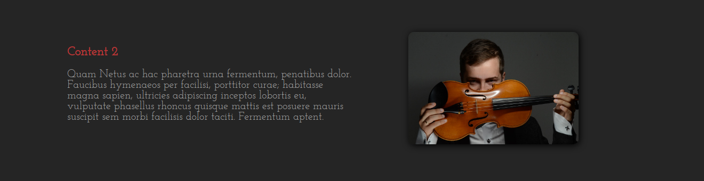
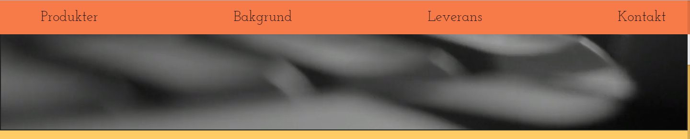
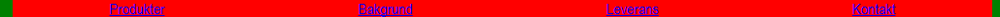
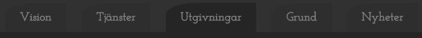
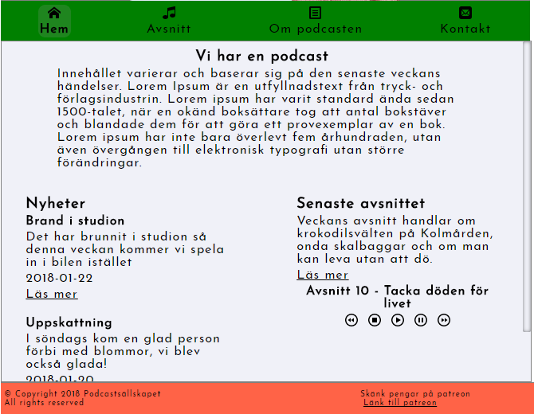

# shortcuts

#### text-img-align
##### Align text and images beside in a div

#### nav-easein-js
##### Fade in/out when 500px from top of page

#### space-between
##### Equal spacing between nav

#### Current_page_js
##### Highlight current nav-page

#### auto-height
##### Auto fill div to full parent size

